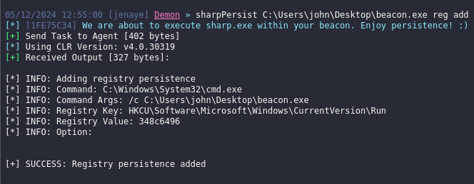
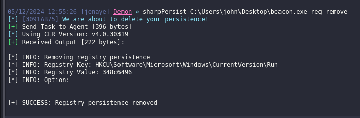
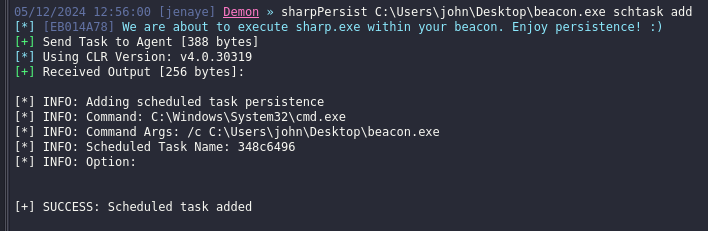

# havoc-sharpPersist

>This module will execute sharp.exe into the demon.exe and create a persistence

# Usage

Go to `Attack > Extensions ` and select havoc-sharpersist + install

you now have a new sharpPersist command available

to use it, here are the parameters to pass: `sharpPersist <path to binary> <Type of persistence> <add/remove>`

# Troubleshoot

if you get this err `Failed to execute assembly or initialize the clr` its probably because AV catch the .exe, edit the source code of SharpPersist and recompile it

https://github.com/HavocFramework/Havoc/issues/483